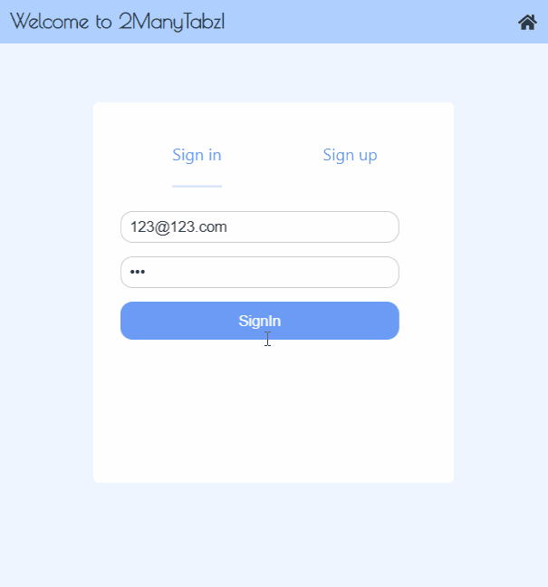
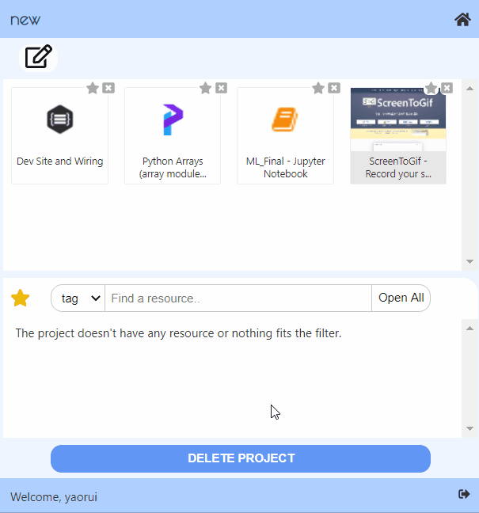
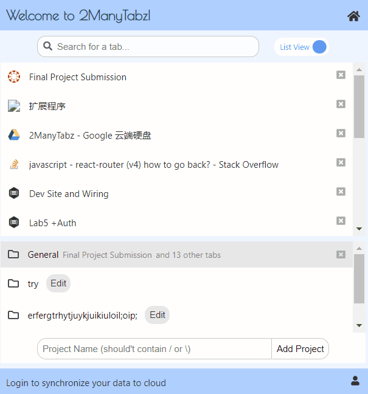

# 2 Many Tabz

## Try it by yourself
* Go to this page:  
  https://chrome.google.com/webstore/detail/2manytabz/lpddhdnkblogiooieonlanekgbkcmcoa  
  And click "Add to Chrome"
* Turn on the extension by clicking the blue radio button at the bottom right corner of the extension box.

## Architecture

### Front-end: 
We use React for the UI, and use Redux to manage the data.

#### App
* Routing to 3 pages and modals
* A footer to control login status
 (Links to an external site.)TabManager:

#### TabView
* Filter tabs according to title
* Switch between grid view and list view
* Capture and show the screenshot for the grid view
* Click to go to a tab
* Click to close a tab
* Drag a tab to a project

#### PojectList:
* Show project list (projectName + tabName + and n other tabs)
* Show projects with tabs that fulfill the filter as strong
* Switch active project (class : choosen)
* Close all the tabs in the project
* Create a new project (check if the name exists)
* (Links to an external site.)ProjectDetail:

#### ProjectEditor:
* Edit the name and note of a project
* TabView:
* Basicly the same as tab manager (open/close), but can not drag a tab
* Add a tab to current project

#### ResourceView:
* Add all opened tabs in the project to resource
* Filter: select box + input, filter by tab or title
* OpenAll: open all the tabs that fits the filter
* Open one tab: by clicking a resource
* Update the resource: when the title and icon of the resource * doesn't match the tab with same url
* Resource: Display the title and tags of a resource
* Click the down button to show detail of the resource and edit the tags
* Bluring event would upload the change of the tags
* Delete the resource

#### Delete Project:
* Delete project and go back to tab manager if succeed

#### Modal
  Recently we have a synchronize modal, a dialog modal and an error modal
  What works:
  * Click the background to close the modal and go back
  
  ##### Synchronize modal
  * To switch the synchronize status
  * When synchronize is choosen, wait for synchronizing

### Store
* For the front end, data is stored in the background
* Pop up page use actions (redux for chrome would send them as messages) to change data in store 
* Several listeners are added to listen to tab update/ activate / remove events
* Since direct communication (through stringified js objects, could not convey functions) can not handle promises or handle error, we use aliases to conduct actions in background pages
* Data in store:
```js
const initialState = {
 tabs: {
    tabList: {},
    activeTab: -1,
    activeWindow: -1,
    movingTab: null,
  },
  projects: {
    projectList: loadProjectList(), // An array of projects
    currentProject: JSON.parse(Values.emptyProject), // { projectName: '', projectNote: '', resources: {} }
    activeProj: Values.defaultProject, // General
    synchronizing: 0,
  },
  preferences: loadPreferences(),
  // View: 0 -> ListView, 1 -> GridView
  // Synchronize: -1 -> unknown, 0 -> don't synchronize, 1 -> synchronize
  auth: {
    authenticated: false,
    userName: '',
  },
  error: {
    errorMsg: '',
  },
};
```
A listener is added to store. If the state of store has been changed, write the new preferences to local storage. If has been logged in and not using synchronize, would not update project info, otherwise write the new project list and new current project

### Communicate with Backend

* Methods are defined in src/modules/ajax.js
* Methods are called from src/background/aliases4project;  
  Could refer to local methods for inspiration!
     
### Back-end: 
We use Express + MongoDB for the backend.

 * Tab Model
     * URL
     * Title
     * Icon Url
     * Tags 
     * Parent (project id)
 * Project/Folder Model
     * Name
     * Custom Notes
     * User (id of the user who created the project)
 * User model
     * Name
     * Email
     * Password

## Screenshots


## GIFs

### login and synchronize


### Add All Tabs


### Switch Views


## Authors
* Yaorui Zhang
* Jialing Wu
* Katherine Taylor
* Jackson Harris
* Nathan Albrinck
* Yunjin Tong
  
## Acknowledgments
### References:
* https://thoughtbot.com/blog/redux-for-chrome-extensions
* https://blog.csdn.net/weixin_41646716/article/details/89375896
* https://blog.logrocket.com/building-a-modal-module-for-react-with-react-router/
* https://stackoverflow.com/questions/20958078/resize-a-base-64-image-in-javascript-without-using-canvas
* https://dev.to/tchan/web-automation-using-puppeteer-inside-a-chrome-extension-318o
* http://jsfiddle.net/robhawkes/gHCJt/
* https://medium.com/@jrcreencia/persisting-redux-state-to-local-storage-f81eb0b90e7e
