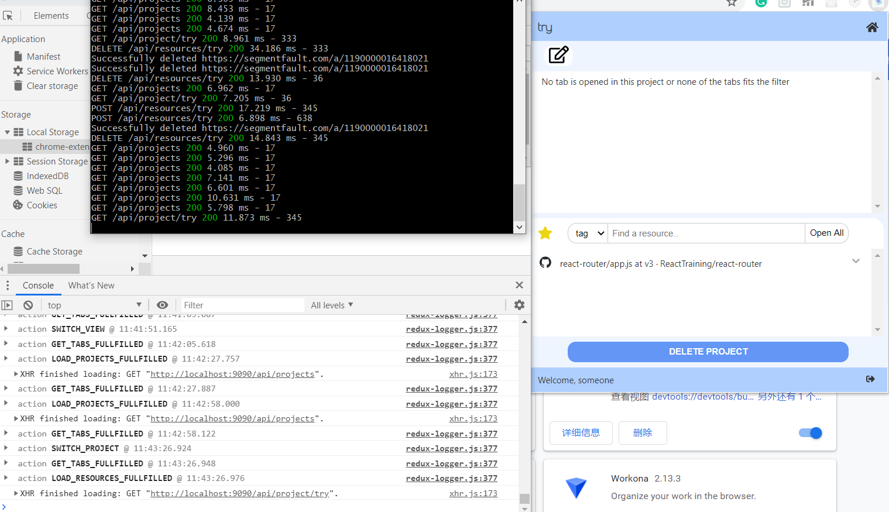

# 2 Many Tabz

## Overview
2ManyTabs is a chrome extension to help you manage your tabs. 

We all run into the silly problem of having simply too many tabs open in a chrome window at a given time. We try to organize these by opening more windows.. then more.. maybe saving a bookmark or two here and there.. but we inevitably lose time struggling to navigate our research windows by icon and memory alone. Not to mention that, upon feeling too frustrated with the current state of our Chrome window, we all resort to just giving up and clicking that red x of doom at the top left corner. We wish there were a way to organize our research on-the-fly and without very much effort.

2ManyTabz would be our solution for you. By using this extension, you would be able to rearrange your tabs easily and create **projects** to store your tabs as resourses.

## What you can do with 2ManyTabz?

### Work on a project
- Create a project and work in the project
- Open/close tabs in the project
- Drag and drop tabs among the project
- Search for tabs by their names (all the projects with tabs that fits the filter would be strengthen)
- Switch working project
- Edit a project (the default project: general is not editable), add notes, add "resources"(we'll talk about it in next session)
- Delete a project

<p align="center">
  
</p>

### Work on resources
- When editing a project, you can add a tab as resource of the project
- Add all the tabs showing in the project as resources at once!
- Add tags to the resources
- Filter the tags by title or by tags, then open all the resources that fits the filter at once!
- Delete a resource

<p align="center">
  
</p>

### Synchronize your data to the cloud
- If the user is not signed in, all the data about the projects would be stored in local storage
- If the user has signed in, the data would be stored in the server's database
- If the user choose to synchronize the data, then at the begining the local data would be uploaded to the server for merging. After that, each operation would change both the local data and data in the remote database

<p align="center">
  
</p>

## Try it by yourself
* You could simply go to this page:  
  [https://chrome.google.com/webstore/detail/2manytabz/lpddhdnkblogiooieonlanekgbkcmcoa](https://chrome.google.com/webstore/detail/2manytabz/lpddhdnkblogiooieonlanekgbkcmcoa)
  and click on "Add to Chrome"
* Turn on the extension by clicking the blue radio button at the bottom right corner of the extension box.

## Architecture

### Front-end
We use React for the UI, and use Redux to manage the data.

#### Popup page components

##### App
* Routing to 3 pages and modals
* A footer to control login status
 (Links to an external site.)TabManager:

##### TabView
* Filter tabs according to title
* Switch between grid view and list view
* Capture and show the screenshot for the grid view
* Click to go to a tab
* Click to close a tab
* Drag a tab to a project

##### PojectList
* Show project list (projectName + tabName + and n other tabs)
* Show projects with tabs that fulfill the filter as strong
* Switch active project (class : choosen)
* Close all the tabs in the project
* Create a new project (check if the name exists)
* (Links to an external site.)ProjectDetail:

##### ProjectEditor
* Edit the name and note of a project
* TabView:
* Basicly the same as tab manager (open/close), but can not drag a tab
* Add a tab to current project
* Delete project and go back to tab manager if succeed

##### ResourceView
* Add all opened tabs in the project to resource
* Filter: select box + input, filter by tab or title
* OpenAll: open all the tabs that fits the filter
* Open one tab: by clicking a resource
* Update the resource: when the title and icon of the resource * doesn't match the tab with same url
* Resource: Display the title and tags of a resource
* Click the down button to show detail of the resource and edit the tags
* Bluring event would upload the change of the tags
* Delete the resource

##### Modal
  Recently we have a synchronize modal (To switch the synchronize status), a dialog modal and an error modal  

#### Background page and store
* For the front end, data is stored in the background
* Popup page uses actions (redux for chrome would send them as messages) to change data in store 
* Several listeners are added to listen to tab update/ activate / remove events
* Since direct communication (through stringified js objects, could not convey functions) can not handle promises or handle error, we use aliases to conduct actions in background pages
* Data in store:
```js
const initialState = {
 tabs: {
    tabList: {},
    activeTab: -1,
    activeWindow: -1,
    movingTab: null,
  },
  projects: {
    projectList: loadProjectList(), // An array of projects
    currentProject: JSON.parse(Values.emptyProject), // { projectName: '', projectNote: '', resources: {} }
    activeProj: Values.defaultProject, // General
    synchronizing: 0,
  },
  preferences: loadPreferences(),
  // View: 0 -> ListView, 1 -> GridView
  // Synchronize: -1 -> unknown, 0 -> don't synchronize, 1 -> synchronize
  auth: {
    authenticated: false,
    userName: '',
  },
  error: {
    errorMsg: '',
  },
};
```
A listener is added to store. If the state of store has been changed, write the new preferences to local storage. If has been logged in and not using synchronize, would not update project info, otherwise write the new project list and new current project

#### Communicate with the backend

* Methods are defined in src/modules/ajax.js
* Methods are called from src/background/aliases4project
     
### Back-end
We use Express + MongoDB for the backend.

 * Tab Model
     * URL
     * Title
     * Icon Url
     * Tags 
     * Parent (project id)
 * Project/Folder Model
     * Name
     * Custom Notes
     * User (id of the user who created the project)
 * User model
     * Name
     * Email
     * Password

## Screenshots


## Authors
* Yaorui Zhang
* Jialing Wu
* Katherine Taylor
* Jackson Harris
* Nathan Albrinck
* Yunjin Tong
  
## Acknowledgments
### References
* [https://thoughtbot.com/blog/redux-for-chrome-extensions](https://thoughtbot.com/blog/redux-for-chrome-extensions)
* [https://blog.csdn.net/weixin_41646716/article/details/89375896](https://blog.csdn.net/weixin_41646716/article/details/89375896)
* [https://blog.logrocket.com/building-a-modal-module-for-react-with-react-router/](https://blog.logrocket.com/building-a-modal-module-for-react-with-react-router/)
* [https://stackoverflow.com/questions/20958078/resize-a-base-64-image-in-javascript-without-using-canvas](https://stackoverflow.com/questions/20958078/resize-a-base-64-image-in-javascript-without-using-canvas)
* [https://dev.to/tchan/web-automation-using-puppeteer-inside-a-chrome-extension-318o](https://dev.to/tchan/web-automation-using-puppeteer-inside-a-chrome-extension-318o)
* [http://jsfiddle.net/robhawkes/gHCJt/](http://jsfiddle.net/robhawkes/gHCJt/)
* [https://medium.com/@jrcreencia/persisting-redux-state-to-local-storage-f81eb0b90e7e](https://medium.com/@jrcreencia/persisting-redux-state-to-local-storage-f81eb0b90e7e)
